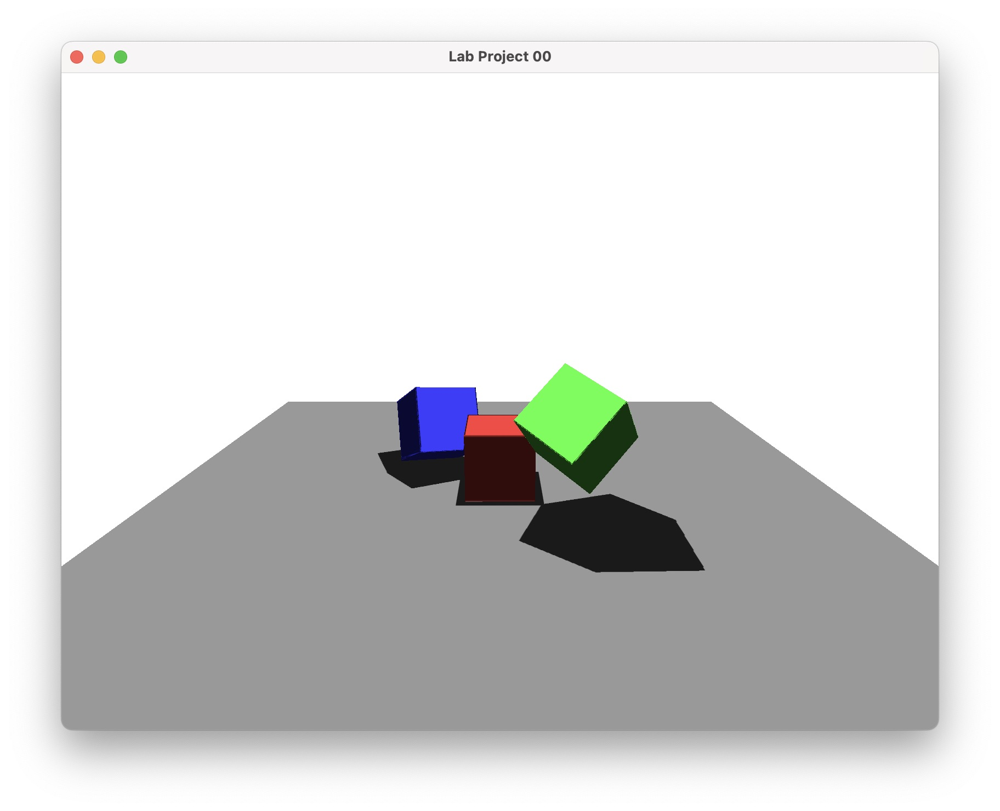

# Lab Project 01

[한국어](#개요)  
[English(Translation)](#overview)  

# 개요
`Rust`언어와 `wgpu`를 사용하여 물체의 그림자를 그리는 것을 구현해 본다.  

# Overview
Let's implement drawing a shadow of an object using the `Rust` language and `wgpu`.  

